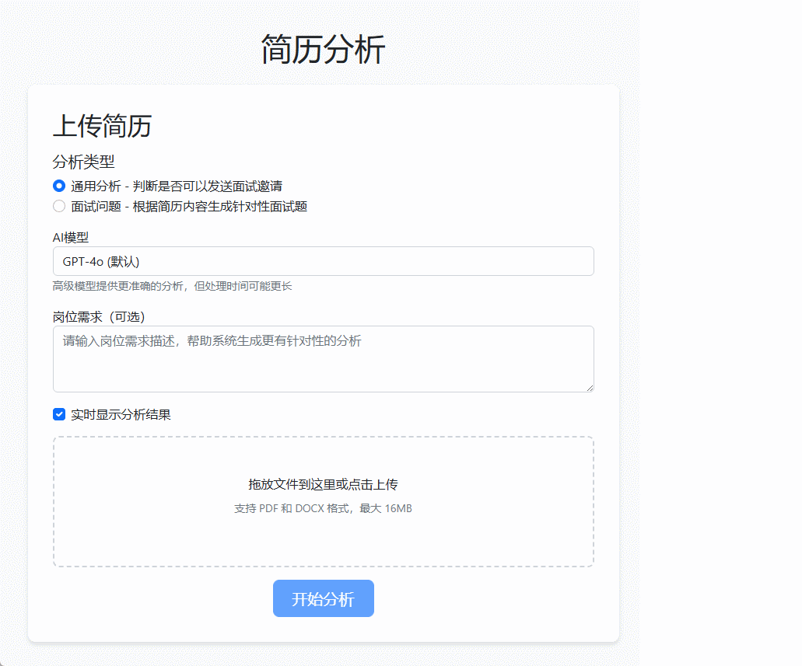
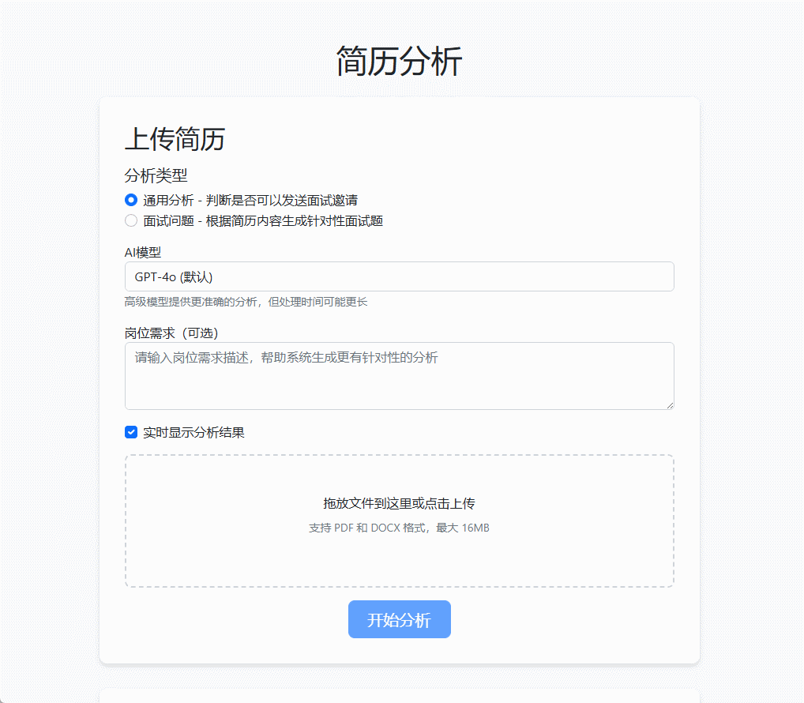

# AI智能面试官


这是一个基于AI的智能面试官助手，能够便利地分析简历，生成面试建议和面试问题，并输出格式化的Markdown文档。
当然作为面试者也可以通过它来检查简历和预演面试问答。

## 缘由

公司打算招收新岗位研发，但没有对应专业知识的人，于是想到了让AI来生成面试问题，并且给出梯度回答的关键词，我就照着面试者的回答囊括了哪些来打分。后面人事又一下发了一大堆简历让我筛选，还是交给Ai来判断吧，一个一个看，那整天就啥事儿也别想干了，况且指不定之后还要更多呢，于是有个这个偷懒工具。


## 安装

```bash
cd ai-interviewer
pip install -r requirements.txt
```

## 使用

### 配置

设置AI的环境变量
```
export OPENAI_KEY=your_api_key_here
export OPENAI_BASE_URL=your_api_base_url

# windows的话
set OPENAI_KEY=your_api_key_here
set OPENAI_BASE_URL=your_api_base_url
```

在`file`文件夹中有示例简历`test_resume.pdf`，此简历是用AI生成，如有雷同，去找openai

### 命令行

```bash
# 简历分析
python tests/general.py ./file/test_resume.pdf
python tests/general.py ./file/

# 面试问题
python tests/interview.py ./file/test_resume.pdf
python tests/interview.py ./file/
```

### web

* 启动：
```bash
cd web
python app.py 
```

* docker 启动：
```bash
docker build -t resume-analysis:v0.1 .
ocker run -d -p 23333:23333 -e OPENAI_KEY= -e OPENAI_BASE_URL=https://oneapi/v1 --name reresume resume-analysis:v0.1
```

* 访问：
```bash
http://127.0.0.1:23333/
```

* 演示：
    * 岗位需求，如果简历中有写目标岗位就可以不填。
    * 实时显示分析结果，对于不支持流式的模型*o1*等，强制关闭。




